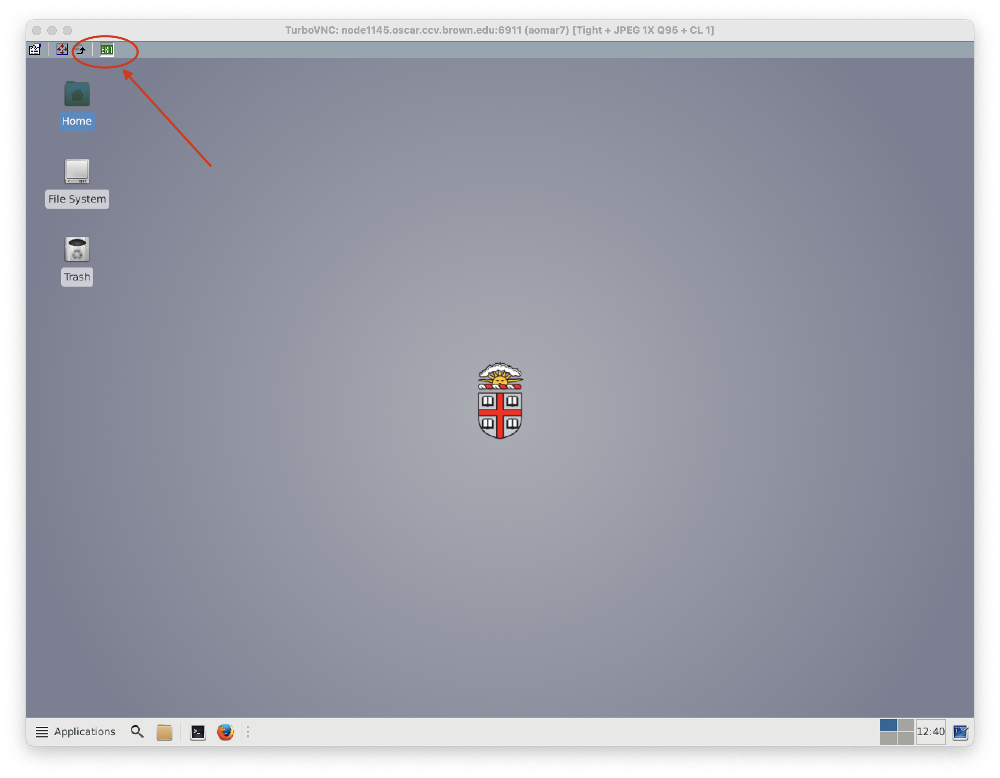
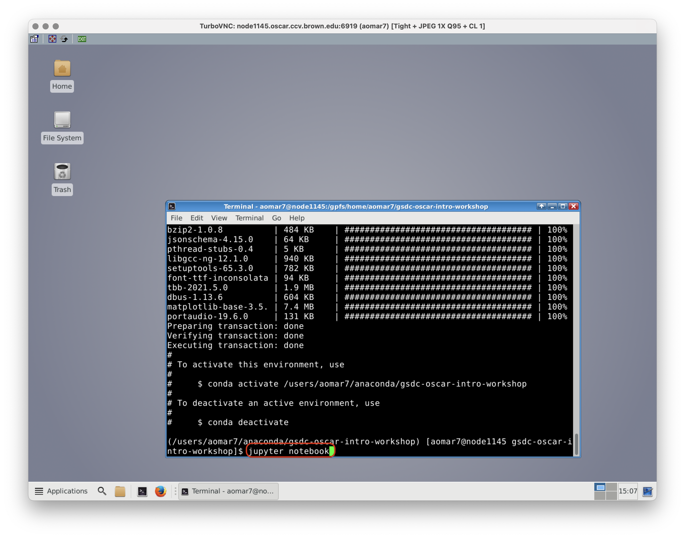
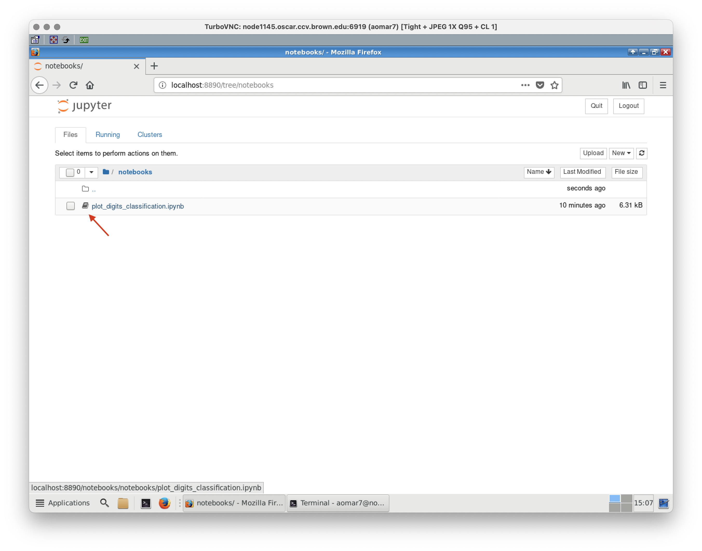

# gsdc-oscar-intro-workshop
Short introduction to using VNC / Jupyter on Oscar

## Connecting to VNC

The most flexible way to connect to Oscar is by using Virtual Network Computing (VNC). VNC nodes allow users to connect remotely to a graphical desktop environment running on an Oscar compute node.

Using VNC, you can run GUI-based applications such as Matlab, Mathematica and Rstudio, with fast access to Oscar's high performance file system. This allows you to analyze and visualize data without needing to move it off of Oscar.

The CCV VNC requires that you download a VNC client onto your machine.

**Instructions**

1. Ensure that you are either connected to [Brown VPN](https://vpn.brown.edu/vdesk/webtop.eui?z=/Common/Brown-Shib-VPN-Brown_VPN_CisAdmin&webtop=/Common/Brown-Shib-VPN-brown-vpn_webtop&webtop_type=webtop_na_only) or on a Brown Compliant Network (BrownWifi, ethernet etc). 

2. Ensure you have a recent version of the Java JDK or JRE. These can be found on [Oracle's Java Download Page](https://www.oracle.com/java/technologies/downloads/).

3. Download the [CCV VNC client](https://drive.google.com/file/d/1MX20afDiKTJC58VzGvGU0GqD-F-8frit/view).

4. If Java has been installed correctly you can now run CCV_VNC_2.x.jar by double clicking on it. 

- On a Mac, you may need to first right click on the jar, choose "Open", and give the jar permission to run. For newer versions, you may need to open a terminal, cd into the directory where the jar file is, and then run java -jar CCV_VNC_2.0.3.jar.
- On Windows, you may have to right click on the jar, Choose "Open with", and select the Java JDK.

5. In the "Username" and "Password" fields, enter your Oscar username and password, respectively. The server should remain desktop.ccv.brown.edu. Press "Connect".

6. On the window that pops up, select the memory/CPU parameters you want for your VNC session.

7. Your VNC session should appear. If you see a window saying your job was queued, it means there were not enough free resources to start your job and it has been placed into the scheduling queue. You will continue to receive that message until your VNC job actually starts. You can monitor the progress of your job in the queue using normal scheduler commands.

8. Once your VNC session starts, you should see your desktop. There are two new buttons on the menubar at the top, Suspend VNC session and End VNC session.

When you are finished with your VNC session, click the "EXIT" button. You now have two choices:
- Disconnect from VNC session closes the client but leaves your VNC session running. When you log in again, you will be automatically connected to your existing VNC session.
- Kill VNC session closes the client and stops your VNC session from running.



## Cloning a GitHub Repo with `gh`
In order to clone the repository, it is most secure to use the GitHub Command Line Tool. This needs some bootstrapping, as you need access to `gh` to clone the repository, which you can most easily install using `conda`, but you'll also need the repository cloned in order to create the `conda` environment from the environment file we provide.

We'll create a minimal `conda` environment with just `gh` for the purposes of this workshop.

Start by loading the `conda` module, which adds the conda binaries to the path and sets some environment variables:
```bash
module load anaconda/2022.05
```

Second, we need to load conda into our shell environment. Running this command means that we don't need to make any changes to the `.bashrc` file, and means that `conda` is only activated for this one session.

```bash
source "/gpfs/runtime/opt/anaconda/2022.05/etc/profile.d/conda.sh"
```

We'll initialize a new conda environment with the following command, which will display information about the environment to be created and ask for confirmation.
```bash
conda create --name gsdc-oscar-intro-workshop
```

Next, we activate the new `conda` environment:
```bash
conda activate gsdc-oscar-intro-workshop
```

We need to install the GitHub Command Line tool next. It isn't available in the anaconda "defaults" channel (the default repository of anaconda packages), so we add the argument `--channel conda-forge` to include the "conda-forge" repository of anaconda packages. The command will display information before running the install.
```bash
conda install --channel conda-forge gh
```

After completing this install, you should be able to run the following command to authenticate the GitHub Command Line Tool:
```bash
gh auth login
```

- At the prompts, select:
    - "? What account do you want to log into?" `GitHub.com`
    - "? What is your preferred protocol for Git operations?" `HTTPS`
    - "? Authenticate Git with your GitHub credentials?" `Y`
    - "? How would you like to authenticate GitHub CLI?" `Login with a web browser`

- At the prompt "! First copy your one-time code:" copy your one-time code which looks like `AB12-34CD`.
- Then press "return". Depending on whether your GUI can open a browser window, it may or may not throw an error at this point. 
- If `gh` doesn't automatically open a browser window, oipen a new tab in a web browser and navigate to the address shown in the prompt [https://github.com/login/device](https://github.com/login/device)
- There, paste the one-time code.
- On the next page, select `Authorize github`.
- Follow any other prompts to complete your login.
- Return to the Oscar window. There may be an error, warning, or a delay, but eventually the Oscar prompt will return (if this takes longer than about a minute, ask for assistance).

You can then clone this repository using this command:
```bash
gh repo clone brown-ccv/gsdc-oscar-intro-workshop
```

**Note**: Previously, it was recommended to add ssh-keys on Oscar directly (in `~/.ssh/`). **This is to be avoided.** Admins have access to those files, and this access could in principle be used to impersonate you on GitHub. Instead, use the `gh` command line tool, or use the `ssh-agent` to use ssh-keys from your laptop.

## Setting up a Conda Environment
To add packages to the `conda` environment, you can either add packages one by one (as above), or install a whole bunch of packages in parallel using an environment file. When adding several packages at once, `conda` will resolve all the dependencies between the packages and (in the best case) ensure that your packages are compatible with each other. 

Next, we'll update the environment we created before with the requirements for this tutorial.

Navigate to the directory with the repository:
```bash
cd gsdc-oscar-intro-workshop
```

There, check that you can read the environment file, which lists the channels we want to use and all of the packages:
```bash
more environment.yml
```

To update the environment, we need to activate it using the commands from above. If you have restarted your shell, then you need to reload the module and the `conda` initialization:

```bash
module load anaconda/2022.05
source "/gpfs/runtime/opt/anaconda/2022.05/etc/profile.d/conda.sh"
```

... then activate the `conda` environment:
```bash
conda activate gsdc-oscar-intro-workshop
```

Then you can run the update command:
```bash
conda env update
```

This will load the `environment.yml` file from the current directory and use it to update the current environment.

**Pro-Tip**: If you're feeling the need for speed, and `conda` doesn't cut it, then `mamba` might be what you want. It's a drop-in replacement for `conda`. You can install it using `conda install -c conda-forge mamba` and then use `mamba env update` instead of the previous command. 

## Loading Jupyter

Now you have all the required packages to load Jupyter. Type ```jupyter notebook``` in your terminal. 



## Running the example

Launch the notebook plot_digits_classification.ipynb in the notebooks directory and try running line by line. 



